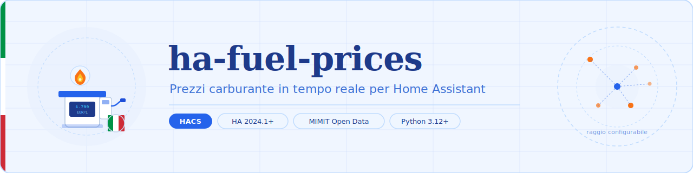

Custom component per Home Assistant che espone sensori con i **prezzi del carburante in Italia** usando i dati open del Ministero delle Imprese e del Made in Italy (MIMIT). Dati pubblici, aggiornati quotidianamente, zero autenticazione.

---

## Caratteristiche

- Scarica i CSV MIMIT (prezzi + anagrafica impianti) in modo asincrono
- Filtra le stazioni nel raggio configurato dalla posizione di casa HA
- Espone sensori con prezzo **minimo, medio e massimo** per ogni carburante
- Modalità **self-service** e **servito** gestite separatamente
- Aggiornamento automatico ogni 6 ore (configurabile)
- Nessuna dipendenza esterna — solo librerie incluse in HA

## Carburanti supportati

| Carburante | Unità | Abilitato di default |
|------------|-------|----------------------|
| Benzina | EUR/L | ✅ |
| Gasolio | EUR/L | ✅ |
| GPL | EUR/L | — |
| Metano (CNG) | EUR/kg | — |
| HVO / Biodiesel | EUR/L | — |
| Blue Diesel | EUR/L | — |

## Installazione

### HACS (consigliato)

1. Apri HACS → **Integrations** → menu in alto a destra → **Custom repositories**
2. Aggiungi `https://github.com/nuggetz/ha-fuel-prices-ita` come tipo **Integration**
3. Cerca "Fuel Prices Italy" e installala
4. Riavvia Home Assistant

### Manuale

1. Copia la cartella `custom_components/fuel_prices_italy/` nella tua cartella `config/custom_components/`
2. Riavvia Home Assistant

## Configurazione

1. Vai in **Impostazioni → Dispositivi e servizi → Aggiungi integrazione**
2. Cerca **Fuel Prices Italy**
3. Configura il raggio di ricerca (default 5 km) e i tipi di carburante da monitorare

> Se la posizione di casa in HA non è configurata, verrà chiesto un indirizzo o città italiana per trovare le stazioni vicine.

## Sensori creati

Per ogni tipo di carburante selezionato vengono create fino a 6 entità:

```
sensor.fuel_gasoline_self_min       # Benzina self — prezzo minimo
sensor.fuel_gasoline_self_avg       # Benzina self — prezzo medio
sensor.fuel_gasoline_self_max       # Benzina self — prezzo massimo
sensor.fuel_gasoline_servito_min    # Benzina servito — prezzo minimo
...
```

Ogni sensore include questi attributi extra:

| Attributo | Descrizione |
|-----------|-------------|
| `stations_count` | Numero di stazioni nel raggio |
| `cheapest_station` | Gestore/brand della stazione più economica |
| `cheapest_station_address` | Indirizzo |
| `cheapest_station_distance_km` | Distanza in km |
| `last_updated` | Timestamp dell'ultimo dato MIMIT |
| `radius_km` | Raggio di ricerca usato |

## Esempio automazione — notifica prezzo sotto soglia

```yaml
automation:
  alias: "Benzina sotto 1.80 €/L"
  trigger:
    - platform: numeric_state
      entity_id: sensor.fuel_gasoline_self_min
      below: 1.80
  action:
    - service: notify.mobile_app
      data:
        title: "Benzina conveniente!"
        message: >
          Prezzo minimo: {{ states('sensor.fuel_gasoline_self_min') }} EUR/L
          presso {{ state_attr('sensor.fuel_gasoline_self_min', 'cheapest_station') }}
          ({{ state_attr('sensor.fuel_gasoline_self_min', 'cheapest_station_distance_km') }} km)
```

## Fonte dati

I dati provengono dal portale open data del **Ministero delle Imprese e del Made in Italy (MIMIT)**, licenza [IODL 2.0](https://www.dati.gov.it/iodl/2.0/).

- CSV prezzi: aggiornato ogni mattina alle 08:00
- CSV anagrafica impianti: aggiornato quando cambiano le stazioni attive

## Requisiti

- Home Assistant **2024.1+**
- Python **3.12+**

## Licenza

MIT
